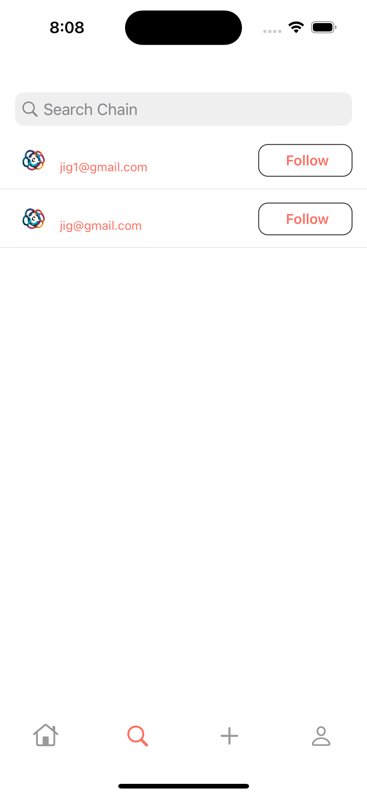

# 🧵 Chain Loop App  

A modern social media platform for real-time conversations, connecting people, and sharing ideas. Inspired by simplicity and creativity, Chain Loop App is designed to enhance meaningful connections in a distraction-free environment.

---

## 🚀 Features  
- **Chain Conversations**: Post updates and reply to create discussion using Chain.  
- **Real-Time Feed**: Explore updates and conversations from people you follow.  
- **Media Support**: Share text, photos, GIFs, and links.  
- **Explore Trends**: Discover trending topics and hashtags.  
- **Profile Customization**: Personalize your bio, profile picture, and cover photo.  
- **Dark Mode**: Toggle between light and dark themes for comfort.  

---

## 🚀 Screenshots
-  -  - 
-  - 
-  -  - 
-  - 

---

## 🛠️ Tech Stack  
- **Frontend**: iOS 16+.  
- **Backend**: Firebase.  
- **Database**: Firebase Store.  
- **Authentication**: Firebase Authentication.  
- **Cloud Storage**: Firebase Cloud Storage.  

---

# License

This project is licensed under the MIT License.

# 🌟 Acknowledgments

Inspired by platforms like Threads and Twitter.
Built with love for seamless communication.

# 📧 Contact

For inquiries or feedback, contact me at jignesh.raiyani1@gmail.com

